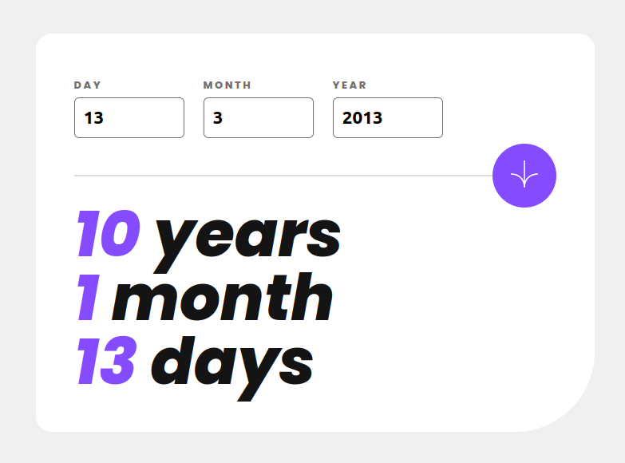

# Frontend Mentor - Age calculator app solution

This is a solution to the [Age calculator app challenge on Frontend Mentor](https://www.frontendmentor.io/challenges/age-calculator-app-dF9DFFpj-Q). Frontend Mentor challenges help you improve your coding skills by building realistic projects. 

## Table of contents

- [Overview](#overview)
  - [The challenge](#the-challenge)
  - [Screenshot](#screenshot)
  - [Links](#links)
- [My process](#my-process)
  - [Built with](#built-with)
  - [What I learned](#what-i-learned)
- [Author](#author)

## Overview

### The challenge

Users should be able to:

- View an age in years, months, and days after submitting a valid date through the form
- Receive validation errors if:
  - Any field is empty when the form is submitted
  - The day number is not between 1-31
  - The month number is not between 1-12
  - The year is in the future
  - The date is invalid e.g. 31/04/1991 (there are 30 days in April)
- View the optimal layout for the interface depending on their device's screen size
- See hover and focus states for all interactive elements on the page
- **Bonus**: See the age numbers animate to their final number when the form is submitted

### Screenshot

### Links

- Solution URL: [Add solution URL here](https://github.com/WarlockJa/agecalculator)
- Live Site URL: [Add live site URL here](https://agecalculator-ebon.vercel.app/)

## My process

### Built with

- Semantic HTML5 markup
- CSS custom properties
- Flexbox
- Mobile-first workflow
- [Vite](https://vitejs.dev/) - Build tool
- [React](https://reactjs.org/) - JS library
- [Jest](https://jestjs.io) - JS Testing Framework

### What I learned

Working on this project I've got a better understanding on how to work with dates in JS. The history of the calendar and the fact that JS Date adds 1900 to a XX year and year 0 doesn't exist. Once again TS and Jest testing were invaluable, especially when it comes to challenges like this, where correct work of the algorithm isn't immediately obvious from the calculated solution.

## Author

- Website - [WarlockJa](https://www.warlockja.ru)
- Frontend Mentor - [@WarlockJa](https://www.frontendmentor.io/profile/WarlockJa)
